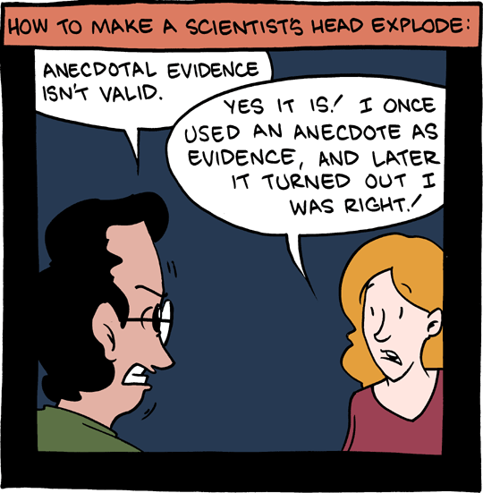
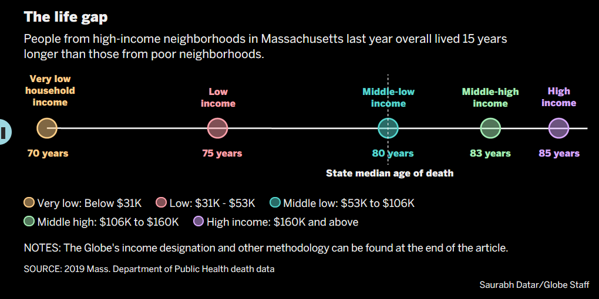
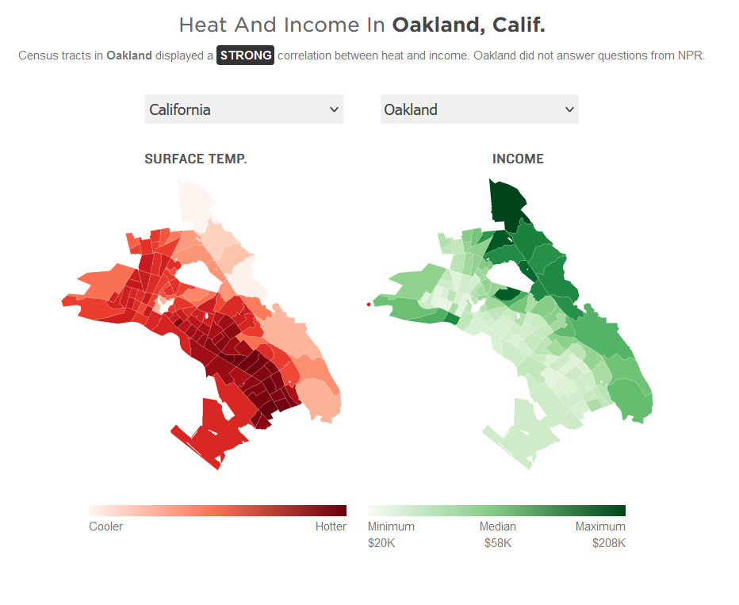
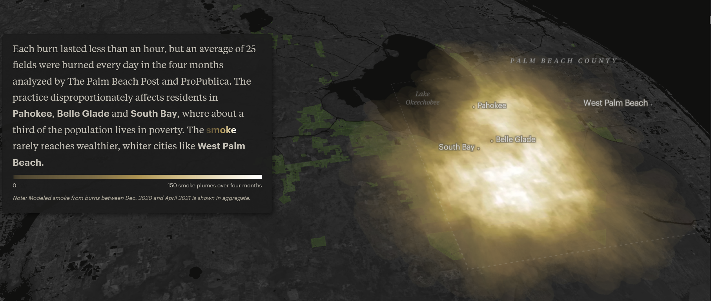

```{r setup, include=FALSE}
options(htmltools.dir.version = FALSE)
knitr::opts_chunk$set(
  fig.width=9, fig.height=3.5, fig.retina=3,
  out.width = "100%",
  cache = FALSE,
  echo = FALSE,
  message = FALSE, 
  warning = FALSE,
  hiline = TRUE
)
```


```{css, echo=F, eval=FALSE}
table {
  font-size: 12px;
}
```

```{r load libraries, include=FALSE}
if(!require("pacman")) install.packages("pacman")

p_load(DT,patchwork,latex2exp,xaringanExtra,xaringanthemer,RColorBrewer,countdown)
```

```{r xaringan-themer, include=FALSE}
library(xaringanthemer)
style_duo_accent(
  header_font_google = google_font("Cabin", "600"),
  text_font_google   = google_font("Noto Sans", "300", "300i"),
  primary_color = "#0f4d92",
  secondary_color = "#FF961C",
  inverse_header_color = "#FFFFFF"
)
```

```{r xaringan-editable, echo=FALSE}
xaringanExtra::use_editable(expires = 14)
```

background-image: linear-gradient(to bottom, rgba(255,255,255,0)0%, rgba(255,255,255,0.2)10%, rgba(255,255,255,1)100%), url("https://ysm-res.cloudinary.com/image/upload/w_850/c_scale,e_blur:1700,u_v1:websites4:live-prod:ysph:about-school-of-public-health:communications-public-relations:photo-galleries:history:Yale-resized_74630_49441_v9,w_850,h_576/v1/websites4/live-prod/ysph/about-school-of-public-health/communications-public-relations/photo-galleries/history/Yale-resized_74630_49441_v9.JPG")
background-size: cover


class: bottom

.pull-left[

<br>
# STEM Meets Storytelling: Day 1
### Pathways to Science 2022

]

.right[

<br>
<br>
<br>
<br>
<br>
### Dr. Mary Ryan
### July 18, 2022

]

---

## One thing to learn today


<br>
<br>
<br>
<br>
.center[
### Data are made up of observations, variables, and values
]


---

## What is data?

.pull-left[

.can-edit.key-likes[
- 
]

]

---

## What is data?

.pull-right[

- A collection of information, facts, or observations for reference or analysis


]

---

## What is data?

.pull-right[

- A collection of information, facts, or observations for reference or analysis

- Usually about multiple subjects, events, time periods, circumstances, etc.

]

---

## What is data?

.pull-right[

- A collection of information, facts, or observations for reference or analysis

- Usually about multiple subjects, events, time periods, circumstances, etc.

- If you record it, and it provides knowledge about something, it's probably data!
]

---

## Data parts

- Observation

  - The smallest unit we're collecting data on
    
    - i.e., Person, state, country, company

--

- Variable

  - One of the questions we're collecting about our observation
  
    - i.e., Age, gender, income, existing health conditions, favorite music

--

- Value

  - The answer to the question we're asking our observation
  
    - i.e, 15 years old, female, $30,000, none, k-pop

---

## Types of variables

- Quantitative variables

--

  - Numbers!
  
--
  
  - Discrete (numbers only occur in "jumps")
  
  - Continuous (fractions/decimals OK)
  
--

- Qualitative variables

--

  - Word descriptions!
  
--
  
  - Categorical (no order to descriptions)
  
  - Ordinal (descriptions have order/ranking)

---

## Activity!


- Groups of 2 or 3

- Gather data about your group members

  - What's their name?
  
  - How old are they?
  
  - What's their favorite food?
  
  - What is their favorite hobby?
  
  - What school do they go to?
  
  - What city do they live in?
  
  - How many siblings do they have?

- Which questions give you *quantitative* answers? Which ones give you *qualitative* answers?

`r countdown(minutes = 5, warn_when=60, top="33%", right="20%")`

---

## Empirical data vs anecdotes

.pull-left[

- Anecdotal evidence: story/account/claim from a single source
  
  - Depends on exact circumstances - might changes from source to source
  
- Empirical data/evidence: information from several sources

  - If something is true, will probably see same thing reported by multiple sources

]

.pull-right[



]

---

## Public data

- Much data is collected and used privately or for a price

  - Companies
  
  - Example: Nielsen TV ratings data
    
      - Asks people to install device on their TV to track what they watch, when, and for how long
    
      - Pays people for participating
    
      - Makes companies/people pay to access data
  
- Some data is public, though

  - Often collected by the government (federal/state/local)

---

## Public data

.pull-left[
- Federal public data sources

  - U.S. Census Bureau/American Community Survey

  - Bureau of Labor Statistics
  
  - National Center for Education Statistics
  
  - Environmental Protection Agency
]

.pull-right[  
- State-level public data sources

  - CT Department of Transportation/DMV
  
  - CT Department of Agriculture
  
  - [CT Department of Public Health](https://portal.ct.gov/DPH)
  
- Local public data sources

  - [City of New Haven](https://www.newhavenct.gov/cityservices/records/default.htm)
  
  - [DataHaven](https://www.ctdatahaven.org/)
  
]

---

## Data to tell community stories

.pull-left[

- Last Words via The Boston Globe

  - [https://apps.bostonglobe.com/metro/investigations/spotlight/2020/09/last-words/](https://apps.bostonglobe.com/metro/investigations/spotlight/2020/09/last-words/)
  
  - Using data from death certificates and surveys to show how race and income determine:
    
    - how and why Massachusetts residents die
    
    - how those factors affect the quality/length of life and access to care

]

.pull-right[

]

---

## Data to tell community stories
  
.pull-left[
  
- Heat and Health in American Cities via NPR

  - [https://www.npr.org/2019/09/03/754044732/as-rising-heat-bakes-u-s-cities-the-poor-often-feel-it-most](https://www.npr.org/2019/09/03/754044732/as-rising-heat-bakes-u-s-cities-the-poor-often-feel-it-most)
  
  - Is there a relationship between the hottest parts of a city and where people live by income?

]
  
.pull-right[


]

---

## Community data to community stories

- Looking at raw data like looking at anecdotes

  - Difficult to see patterns
  
  - Also not always sure if data is giving us the **full context** of the situation
  
- Need to summarize to get the big picture

- Computers can help us keep track of lots of data

---

## R Project

.pull-left[

- R is a coding language specifically made for handling data, computing statistics, and creating data visualization

- Free and open source

  - New code is created/edited by users and given without cost to other users
  
- Makes it easy to **reproduce** what we do to the data

]

.pull-right[


]

--

**We'll be using this on [RStudio Cloud](https://rstudio.cloud/) : [https://rstudio.cloud/](https://rstudio.cloud/)**

---

<!-- --- -->

<!-- ## Public data -->

<!-- - Not all public data is easy to access/available on the internet -->

<!--   - Old paper records not digitized -->

<!--   - Too expensive to put in one big place -->

<!-- - Different states have different "open records" or "open meeting" laws - AKA "sunshine" laws -->

<!--   - Who can ask for access to what data for what reasons -->

<!-- - Connecticut Freedom of Information Act -->

<!--   - Any recorded data/information relating to the conduct of the public’s business prepared, owned, used, received, or retained by a public agency, or to which a public agency is entitled to receive a copy by law or contract -->

<!--   - Anyone may request public records - no reason needed -->

<!--   - No restrictions on the use of the records -->
  
<!-- --- -->

<!-- ## Data to tell community stories -->

<!-- .pull-left[ -->

<!-- - Black Snow: Big Sugar’s Burning Problem via The Palm Beach Post -->

<!--   - [https://projects.propublica.org/black-snow/](https://projects.propublica.org/black-snow/) -->

<!--   - Collect own air quality measurements to check claims by local sugar company that sugarcane burning is not a threat to public health -->

<!-- ] -->


<!-- .pull-right[ -->
<!--  -->

<!-- ] -->