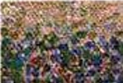
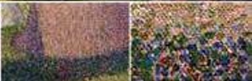
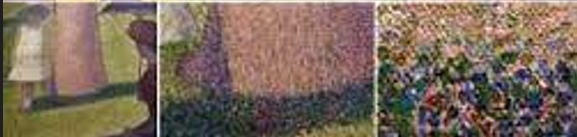
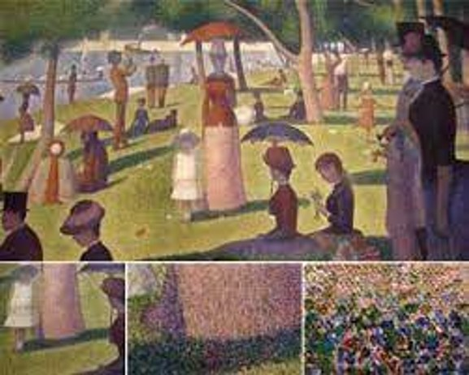

```{r setup, include=FALSE}
options(htmltools.dir.version = FALSE)
knitr::opts_chunk$set(
  fig.width=9, fig.height=3.5, fig.retina=3,
  out.width = "100%",
  cache = FALSE,
  echo = FALSE,
  message = FALSE, 
  warning = FALSE,
  hiline = TRUE
)
```


```{css, echo=F,eval=F}
table {
  font-size: 12px;
}
```

```{r load libraries, include=FALSE}
if(!require("pacman")) install.packages("pacman")

p_load(DT,patchwork,latex2exp,xaringanExtra,xaringanthemer,RColorBrewer,janitor,countdown)
```

```{r xaringan-themer, include=FALSE}
library(xaringanthemer)
style_duo_accent(
  header_font_google = google_font("Cabin", "600"),
  text_font_google   = google_font("Noto Sans", "300", "300i"),
  primary_color = "#0f4d92",
  secondary_color = "#FF961C",
  inverse_header_color = "#FFFFFF"
)
```

```{r xaringan-editable, echo=FALSE}
xaringanExtra::use_editable(expires = 1)
```

background-image: linear-gradient(to bottom, rgba(255,255,255,0)0%, rgba(255,255,255,0.2)10%, rgba(255,255,255,1)100%), url("https://ysm-res.cloudinary.com/image/upload/w_850/c_scale,e_blur:1700,u_v1:websites4:live-prod:ysph:about-school-of-public-health:communications-public-relations:photo-galleries:history:Yale-resized_74630_49441_v9,w_850,h_576/v1/websites4/live-prod/ysph/about-school-of-public-health/communications-public-relations/photo-galleries/history/Yale-resized_74630_49441_v9.JPG")
background-size: cover


class: bottom

.pull-left[

<br>
# STEM Meets Storytelling: Day 3
### Pathways to Science 2022

]

.right[

<br>
<br>
<br>
<br>
<br>
### Dr. Mary Ryan
### July 20, 2022

]


---

## One thing to learn today

<br>
<br>
<br>
<br>
<br>
.center[
### Summarizing data can help us quickly get an idea of what’s going on with the observations as a whole and not get lost in the details
]

---

## Data can be A Lot

```{r lots o data}
data(billboard)

billboard %>% 
  pivot_longer(
    wk1:wk76, 
    names_to = "week", 
    values_to = "rank", 
    values_drop_na = TRUE
  ) %>% 
  janitor::clean_names() %>% 
  arrange(desc(date_entered,week,rank)) %>% 
  datatable(
    options = list(
      scrollY = 350,
      pageLength = 1000,
      dom = "t",
      ordering = FALSE,
      columnDefs = list(list(className = 'dt-left', targets = "_all"))
    ),
    rownames=FALSE
  )

```

---

## Why summarize data?


<div style="position:fixed; left:350px; bottom:50px">
  
</div>

<div style="position:fixed; right:150px; top:150px">
<ul>
  <li>Raw data is like looking closely at a painting</li>
</ul>
</div>

--

<div style="position:fixed; left:200px; bottom:50px">
  
</div>

<div style="position:fixed; right:150px; top:200px">
<ul>
  <li>We need to zoom out to get the Big Picture</li>
</ul>
</div>

--

<div style="position:fixed; left:50px; bottom:50px">
  
</div>

--

<div style="position:fixed; left:50px; bottom:50px">
  
</div>

<div style="position:fixed; right:58px; top:250px">
<ul>
  <li>“A Sunday Afternoon on the Island of La Grande Jatte”<br/> by George Seurat</li>
</ul>
</div>

---

## What do we want data to tell us?

.can-edit.key-tell[
- 
]

---

## Describing data

.pull-left[
What ways might you use to describe a dataset?

.can-edit.key-decribe[
- 
]

]

.pull-right[
What ways might you use to describe a "typical" data point?

.can-edit.key-typical[
- 
]

]


---

## Describing categorical data

- For categorical data, we might want to:

  - Know how many observations are in each category
  
      - Counts

  - Know how large a category is compared to all observations

      - Percentages

        $$\frac{\text{# observations in a category}}{\text{Total observations×100}}$$

---

## Describing quantitative data

- For quantitative data, we might want to:

  - Know what the smallest value of a variable is

      - Minimum

  - Know what the largest value of a variable is

      - Maximum

  - Know the distance between the maximum and the minimum
      
      - Range

  - Know what the center of our data is...


---

## How would you measure the "middle" of a dataset?

.can-edit.key-middle[
- 
]


---

## Journey to the center of the data

- Mean

  - The "typical value" of the data

$$\bar{x} = \frac{\text{sum of data points}}{\text{# of data points}}$$

- Median

  - The "exact middle" of the data

  - 50% of data points are below the median, 50% of data points are above the median

- Mode

  - The most common value in the data

---

## How different are our data points?

- We might also want to know how much our observations **vary**

  - Nice to compare how far away observations are from the center of the data (deviation) on average (standard)
  
$$\text{standard deviation} = \sqrt{\frac{(\text{datapoint}_1 - \bar{x})^2 + (\text{datapoint}_2 - \bar{x})^2 + \dots}{\text{# of data points} - 1}}$$

- When standard deviation is **large**, the observations vary from the mean a lot

- When standard deviation is **small**, the observations generally stay close to the mean


---

## Activity!

- Everyone grab a buddy & come to the whiteboard

- Take turns measuring your buddy's height

- Can we guess what the mean class height is? The median? The standard deviation?

`r countdown(minutes = 5, warn_when=60, top="10%", right="15%")`